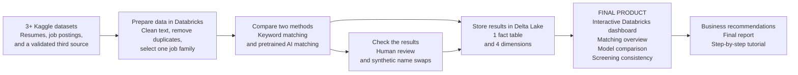

# AI Resume Matching and Screening Consistency

An IS 4030 data project by **Skynet Squad**.

Our final product is an **interactive Databricks dashboard** that helps explain where automated resume matching works well and where a person should review its results. A SQL star schema in Delta Lake supports the dashboard. Two scoring methods supply measurements for the team's analysis.

We are building a small screening experiment, not testing a commercial ATS. Our results will describe our sample and methods, not every hiring system.

## How the project works



**Example:** A job asks for SQL and Power BI. We compare a resume using those exact terms with one describing related work in different words. The dashboard shows how the two methods rank the candidates and how those results compare with our team's independent review. We also change synthetic names while keeping qualifications identical to see whether scores change.

## What the dashboard will show

| Page | What users can explore | Question it answers |
| --- | --- | --- |
| Matching overview | Selected jobs, resume counts, score distributions, and ranked matches | Which resumes does each method consider similar to a job? |
| Model comparison | Keyword and AI scores, ranking differences, and human-review results | Does semantic matching agree more closely with our reviewers on the reviewed sample? |
| Screening consistency | Paired score and rank changes when only synthetic names change | Are our methods sensitive to a name change when qualifications stay the same? |

Users will filter by job and model, with relevant/control categories and experiment conditions where appropriate. Scores measure text similarity, not a candidate's probability of being hired. We will not show hiring funnels or outcomes that our sources do not contain.

## Study scope

- **One job family:** Data Analyst / Business Intelligence.
- **2–3 target job postings and 300–500 resumes:** 70% tech/data relevant and 30% out-of-domain controls, such as healthcare or sales.
- **Keyword baseline:** scikit-learn TF-IDF and cosine similarity.
- **AI method:** pretrained [all-MiniLM-L6-v2](https://huggingface.co/sentence-transformers/all-MiniLM-L6-v2) embeddings and cosine similarity. We are not training a model from scratch.
- **Human review:** 30–50 unique resume/job pairs rated with a documented 1–5 rubric.
- **Consistency experiment:** synthetic name changes on identical qualifications, using fixed scoring methods and the same qualification text.

The small mock example will contain two jobs and four resumes so we can check the workflow before loading the full study sample. It is not evidence of model accuracy.

## Data and warehouse

The course requires **at least three distinct raw datasets**. Proposed sources are [resumes](https://www.kaggle.com/datasets/saugataroyarghya/resume-dataset), [LinkedIn data jobs](https://www.kaggle.com/datasets/joykimaiyo18/linkedin-data-jobs-dataset), and [recruitment data](https://www.kaggle.com/datasets/surendra365/recruitement-dataset). The team must validate their contents, licenses, quality, and integration before final selection. The third source must have a useful, documented role; we will not invent links between unrelated candidates.

Databricks will hold raw data, cleaned study inputs, and the final Delta tables. The star schema will include:

- `fact_evaluation`: one resume/job/model/test-condition evaluation in the frozen study run.
- `dim_resume`: candidate study records and relevant/control categories.
- `dim_job`: the selected job postings.
- `dim_model`: keyword and semantic methods.
- `dim_test_condition`: normal scoring and controlled name-test conditions.

Human ratings and detailed audit results will live in companion tables. The scoring output contract is:

```text
evaluation_id, resume_id, job_id, model_name,
similarity_score, rank_position, test_condition_id
```

The team will preserve source IDs, preparation decisions, sample IDs, model versions, and verification evidence so the results can be reproduced.

## Who owns the work

| Role | Main responsibility | GitHub work |
| --- | --- | --- |
| Project Manager / AI and Testing Lead | AI implementation, testing, coordination, instructor feedback, AI log, and combined submissions | [Scoring](https://github.com/wadeburton/IS4030-ATS-project-/issues/3), [audits](https://github.com/wadeburton/IS4030-ATS-project-/issues/4), and testing across all issues |
| Data Engineer | Validate three sources, clean and sample data, and document ETL | [Data foundation](https://github.com/wadeburton/IS4030-ATS-project-/issues/1) |
| BI Data Architect | Build the Delta star schema, relationships, and loading queries | [Warehouse](https://github.com/wadeburton/IS4030-ATS-project-/issues/2) |
| Dashboard Developer | Build and document the three Databricks dashboard pages | [Dashboard and delivery](https://github.com/wadeburton/IS4030-ATS-project-/issues/5) |
| Business Strategist | Business case, review rubric, research, interpretation, and recommendations | [Validation](https://github.com/wadeburton/IS4030-ATS-project-/issues/4) and [report](https://github.com/wadeburton/IS4030-ATS-project-/issues/5) |

The Project Manager owns testing. Other roles check their own outputs and provide evidence. All members contribute independent human ratings and document their actual AI assistance.

## Course deliverables

1. **Deliverable 1: Charter, scope, and data foundation.** Confirm roles and Databricks, identify three datasets and their integration, and create an owned report/tutorial outline.
2. **Deliverable 2: Preliminary architecture and report.** Submit at least five fully written pages, an initial star-schema diagram, APA research, actual data-loading screenshots, tutorial progress, and early AI-log entries. Meet with the instructor for feedback.
3. **Deliverable 3: Final analysis and report.** Deliver the working dashboard, validated warehouse, 10–15 page core report, evidence-based recommendations, reproducible tutorial, final AI Verification Log, and one-page AI reflection.

Detailed role instructions and checklists are in [Issue #5](https://github.com/wadeburton/IS4030-ATS-project-/issues/5). Every role supplies its own written sections, screenshots, tutorial steps, and verification evidence.

## Current status and limits

This README describes the planned final product. The five issues track implementation; the finished dashboard and validated study results are not yet published here.

Similarity alone does not establish matching accuracy. The small human-review sample supports a limited comparison, and synthetic name tests do not prove demographic discrimination or real hiring outcomes. Recommendations will follow the observed results and these limits.
